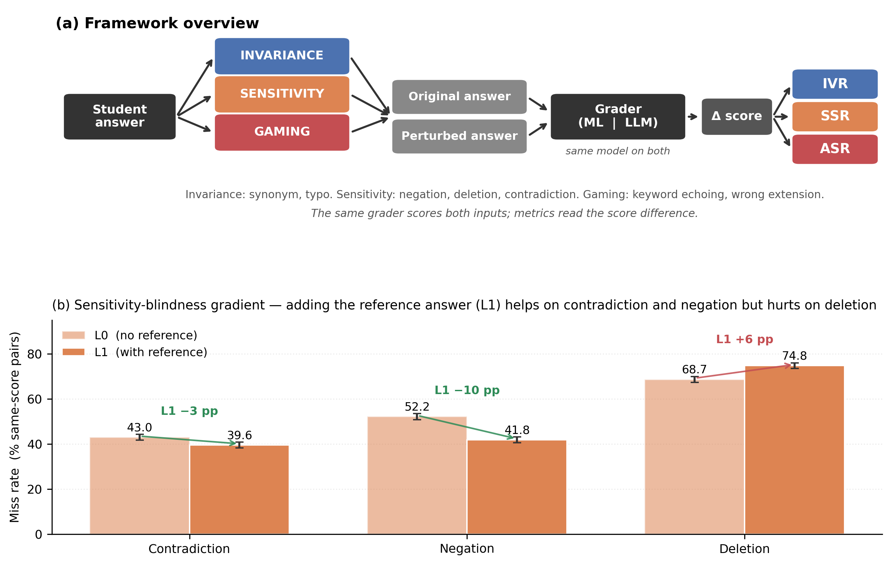

# IFKAD 2026 Full Paper — Draft

> **Format target:** Calibri 10pt, A4, 2.54cm margins, fully justified.
> **Length:** 3,000–5,000 words including abstract, figures, references. Max 10 pages, 4MB.
> **References:** Harvard style. No footnotes, no endnotes.

---

## TITLE

Perturbation-First Robustness Evaluation of Automated Short Answer Grading: Quantifying the Hidden Fragility of Trained and Zero-Shot Graders

## AUTHORS

Ferdinando Sasso, Andrea De Mauro
LUISS Guido Carli University, Rome, Italy
fsasso@studenti.luiss.it
ademauro@luiss.it

## ABSTRACT

Automated Short Answer Grading (ASAG) is increasingly deployed in high-stakes educational contexts, yet the dominant evaluation paradigm focuses primarily on agreement with human raters, overlooking robustness as a complementary quality dimension. Robustness — the consistency of grading behaviour under controlled, meaning-aware input transformations — speaks directly to construct validity, the degree to which an assessment measures what it claims to measure, and is a precondition for trustworthy automated decisions in education.

We propose a perturbation-first evaluation framework that assesses robustness across three validity-theoretic dimensions: invariance to construct-irrelevant variation, sensitivity to meaning-altering changes, and resistance to adversarial gaming. The framework combines rule-based perturbation generators, two-gate quality validation, and self-referential metrics that compare the grader against its own output rather than against gold labels, isolating robustness from accuracy. A dual-protocol design contrasts within-question evaluation, the optimistic scenario typically reported in the literature, with cross-question evaluation, the realistic deployment scenario, capturing how trained graders degrade under distribution shift.

We apply the framework to a benchmark ASAG dataset of science short answers and compare a trained machine-learning baseline with zero-shot Large Language Model graders evaluated at two prompting levels, with and without access to a reference answer. Three findings emerge. First, trained graders exhibit substantial robustness degradation under realistic cross-question evaluation, suggesting that standard within-question benchmarks overestimate operational reliability. Second, zero-shot LLM graders demonstrate stronger robustness on invariance and sensitivity dimensions while remaining comparatively less vulnerable to adversarial manipulation, although residual sensitivity failures follow a structured hierarchy across perturbation types. Finally, providing reference answers introduces a non-obvious trade-off — improved consistency on meaning-preserving variations but increased susceptibility to keyword-based gaming — which is invisible to single-metric evaluation.

We argue that multi-dimensional robustness evaluation should complement accuracy metrics in ASAG systems intended for consequential use, and release an open-source framework to support this approach.

## KEYWORDS

Automated Short Answer Grading; Robustness Evaluation; Perturbation Testing; Large Language Models; Construct Validity

## PAPER TYPE

Academic Research Paper

---

## 1  Introduction

Automated Short Answer Grading (ASAG) systems assign grades to free-text student responses by comparison with reference answers. The dominant evaluation paradigm — accuracy or Quadratic Weighted Kappa against gold labels — reveals an important blind spot: a grader may agree with human raters on clean test data yet behave erratically when inputs vary in superficial, meaning-preserving ways. Such inconsistency violates construct validity and undermines the pedagogical purpose of assessment (Messick, 1989; Williamson et al., 2012). Operational ASAG systems are also vulnerable to simple adversarial inputs (Ding et al., 2020; Kumar et al., 2020; Filighera et al., 2024), yet such vulnerabilities remain largely absent from standard benchmarking.

We argue that robustness should be evaluated alongside accuracy as a first-class quality dimension and propose a perturbation-first framework built on three families targeting distinct validity threats: invariance (construct-irrelevant variance), sensitivity (construct underrepresentation), and gaming (adversarial manipulation). Four metrics compare the grader against itself rather than against gold labels, isolating robustness from accuracy, and a dual-protocol design (Leave-One-Question-Out vs. within-question 80/20 split) quantifies how much consistency a trained grader loses beyond its training distribution.

We apply this framework to the SemEval 2013 Beetle dataset (5,199 answers, 42 questions), evaluating a hybrid ML baseline and a Large Language Model grader (GPT-5.4 mini) at two prompting levels. The contributions of this work are threefold: a perturbation-first evaluation framework grounded in validity theory; a dual-protocol design that exposes the extent to which within-question evaluations overestimate operational reliability; and a cross-paradigm comparison that documents a structured sensitivity-blindness gradient and a non-obvious gaming trade-off introduced by reference-answer prompting.

**Figure 1.** Framework overview and headline finding. **(a)** Pipeline: seven generators across three perturbation families produce paired (original, perturbed) inputs to the grader; three self-referential metrics (IVR, SSR, ASR) compare it against itself. **(b)** Sensitivity-blindness gradient in GPT-5.4 mini with 95% bootstrap CI. Reference prompting (L1) reduces missing on negation and contradiction but **increases** it on deletion — the L1 paradox.

---

## 2  Theoretical Background

### 2.1  ASAG Methods and the Limits of Accuracy-Centred Evaluation

The ASAG literature spans nearly two decades of methodological progress, from lexical and dependency-based approaches (Mohler et al., 2011; Burrows et al., 2015) to transformer-based models (Sung et al., 2019; Condor et al., 2021). Across this trajectory, evaluation has predominantly reported agreement with human raters via accuracy, Quadratic Weighted Kappa, or correlation, while the gap between in-distribution agreement scores and operational reliability has long been a concern of the educational measurement community (Heilman and Madnani, 2015; Williamson et al., 2012; Deane, 2013).

### 2.2  Construct Validity as a Theoretical Foundation

The limits of agreement-based evaluation are best understood through construct validity — the degree to which an assessment measures what it claims to measure (Messick, 1989; Kane, 2006). Messick's framework identifies two principal threats: *construct-irrelevant variance* (scores influenced by factors unrelated to the construct, e.g. a grader penalising a correct answer for a typo) and *construct underrepresentation* (the assessment fails to capture meaningful aspects of the construct, e.g. a grader missing a negation that inverts meaning). To these, the literature on automated scoring has added a third threat specific to algorithmic systems — *adversarial gaming*, in which surface manipulations such as keyword stuffing artificially inflate scores (Williamson et al., 2012; Ferrara and Qunbar, 2022).

### 2.3  Adversarial and Perturbation-Based Evaluation

Perturbation-based evaluation is a standard methodology for assessing NLP model robustness. Ribeiro et al. (2020) introduced CheckList, a behavioural testing framework that systematically probes model capabilities through invariance, directional, and minimum-functionality tests. The general adversarial-NLP literature provides a wide toolkit of attack strategies, surveyed in Wang et al. (2022).

Within automated scoring, adversarial vulnerabilities have been documented but not systematically addressed. Ding et al. (2020) showed that content scoring systems could be fooled by random character strings, Kumar et al. (2020) attacked essay scoring with simple perturbations, and Filighera et al. (2024) extended this work to ASAG via adversarial adjectives and adverbs. Each focuses on a single attack family, and none proposes a unified, multi-dimensional framework anchored to validity theory.

### 2.4  LLM-Based Scoring and Open Questions

The emergence of large language models has introduced a new paradigm in which scoring is performed via zero-shot or few-shot prompting rather than supervised training (Mizumoto and Eguchi, 2023; Naismith et al., 2023; Latif and Zhai, 2024). These studies report encouraging accuracy figures but do not characterise robustness. Two questions are pressing: whether the cross-question robustness drop documented for trained models also affects zero-shot LLM graders, and whether prompting interventions (e.g. supplying a reference answer) interact uniformly with all validity dimensions or produce trade-offs invisible to accuracy alone.

---

## 3  Methodology

### 3.1  Framework Architecture

The evaluation framework follows a unidirectional pipeline (Figure 1a): data loading, perturbation generation, grading, metric computation, and cross-protocol comparison. All data flows through validated immutable models (questions, answers, perturbations, grade results) to ensure reproducibility. The framework is implemented in Python and released as an open-source pip-installable package (`asag-perturbation`) with a public API and command-line interface; source code, evaluation scripts, and the analyses reported in this paper are available at https://github.com/NNSS666/asag-perturbation-framework.

### 3.2  Perturbation Generation

Seven rule-based generators produce up to ten perturbation variants per student answer, organised into three families.

**Invariance family.** Synonym substitution replaces content words with WordNet synonyms, producing up to two variants per answer (selected deterministically for reproducibility); typo insertion introduces a single character-level modification (swap, deletion, or duplication) into one content word.

**Sensitivity family.** Negation insertion adds "not" after auxiliary verbs or prepends "It is not true that" as a fallback. Key concept deletion removes one domain-relevant content word selected via seeded random sampling. Semantic contradiction replaces domain terms with curated antonyms (e.g., "open" → "closed", "series" → "parallel") drawn from a 40-pair dictionary covering physics and biology vocabulary.

**Gaming family.** Rubric keyword echoing appends reference-answer keywords absent from the student response, simulating keyword stuffing; fluent wrong extension appends a confident but factually incorrect domain statement from a curated pool of plausible-sounding misconceptions.

**Box 1 — Examples** (perturbation in **bold**):

- *Synonym (invariance):* "the **bulb** lights up" → "the **lamp** lights up"
- *Negation (sensitivity):* "the terminals are connected" → "the terminals are **not** connected"
- *Deletion (sensitivity):* "the battery is in **a closed path**" → "the battery is in **a path**"
- *Contradiction (sensitivity):* "switches connected in **series**" → "switches connected in **parallel**"
- *Gaming:* "the bulb stays on" → "the bulb stays on **because voltage flows backwards**"

### 3.3  Two-Gate Quality Validation

Invariance perturbations undergo two validation gates before acceptance. Gate 1 applies only to synonym substitution: candidate texts must achieve cosine similarity of at least 0.85 with the original, measured via sentence-BERT embeddings (all-MiniLM-L6-v2). Gate 2 applies to all invariance types: candidates introducing new negation markers or antonyms not present in the original are rejected. Rejected candidates are not regenerated, and the rejection rate is reported as a research result. The gates encode the *perturbation-level* ground truth — whether a candidate variant preserves meaning as intended — and are distinct from the *answer-level* gold labels supplied by the dataset (Section 4.1), which encode whether the original student answer is correct.

### 3.4  Robustness Metrics

All metrics compare the grader's score on the original answer against its score on the perturbed answer, isolating robustness from accuracy.

**IVR_flip** (Invariance Violation Rate, binary): the proportion of invariance pairs where the score changed at all; lower is better.

**IVR_absdelta** (Invariance Violation Rate, continuous): the mean absolute score difference across invariance pairs, capturing violation magnitude.

**SSR_directional** (Sensitivity Success Rate): the proportion of sensitivity pairs where the perturbed score strictly decreased; higher is better, and no-change counts as a failure to detect the modification.

**ASR_thresholded** (Adversarial Success Rate): the proportion of gaming pairs where the score crossed from below the passing threshold (0.5) to at or above it. Already-passing answers that increase further are excluded.

The four metrics are reported on their canonical scales rather than aggregated into a composite index, which preserves continuity with the validity-theoretic constructs each metric targets and avoids the arbitrariness of weighting heterogeneous dimensions whose practical importance varies by deployment context. Joint reading across the three dimensions, illustrated in Section 5.2, surfaces the trade-offs that single-metric evaluation hides.

### 3.5  Dual-Protocol Evaluation

The dual-protocol design targets trained graders and quantifies how much robustness they lose on unseen questions. Protocol A (Leave-One-Question-Out) implements cross-question evaluation: for each of 42 questions the grader is trained on answers from all other questions and tested on the held-out one, with a leakage diagnostic verifying that no held-out question text appears in training. This is the realistic deployment scenario. Protocol B (within-question 80/20) implements in-distribution evaluation: for each question independently, answers are split 80/20 with stratified sampling on gold labels and the grader is trained and tested on the same question. This is the optimistic scenario typically reported in the literature.

The **robustness drop** is the difference between A and B aggregate metrics, macro-averaged across questions. Zero-shot Large Language Model graders receive an identical prompt regardless of split, so their A and B results are equivalent up to sampling noise; we therefore evaluate them on absolute metrics and compare against the trained baseline's Protocol A, the most demanding condition.

---

## 4  Experimental Setup

### 4.1  Dataset

We use the SemEval 2013 Task 7 Beetle dataset (Dzikovska et al., 2013), comprising 5,199 student answers to 42 science questions about electrical circuits. Answers are labelled on a five-way scale (correct, partially_correct_incomplete, contradictory, non_domain, irrelevant) and normalised to a continuous [0, 1] scale (correct = 1.0, partial = 0.5, others = 0.0) following the ASAG2024 benchmark convention. These dataset-supplied labels constitute the *answer-level* ground truth used to interpret robustness results; the *perturbation-level* ground truth is enforced by the two-gate validation of Section 3.3 and by the rule-based construction of each perturbation type. The robustness metrics themselves do not consult either ground truth, since they compare the grader against itself.

### 4.2  Graders

**Hybrid ML baseline.** A logistic regression classifier trained on 388-dimensional feature vectors: four handcrafted linguistic features (lexical overlap, length ratio, negation flag, reference-token recall) concatenated with 384-dimensional sentence-BERT embeddings (all-MiniLM-L6-v2; Reimers and Gurevych, 2019). Class weights are balanced to handle label imbalance. This configuration is broadly representative of strong feature-based ASAG baselines (Sung et al., 2019; Condor et al., 2021).

**LLM grader.** Zero-shot prompting of GPT-5.4 mini at two information levels. Level 0 supplies the question and the student answer only; Level 1 additionally supplies the reference answer and instructs the model to compare the student response against it. Temperature is set to 0.0 for near-deterministic output, with a fixed seed for reproducibility, and the model outputs a JSON object with a label and a confidence score mapped to the same [0, 1] scale as the gold labels. Because the model operates in a zero-shot regime, the dual-protocol distinction does not alter its input, and it is evaluated once against the HybridGrader's Protocol A.

### 4.3  Perturbation Statistics

The perturbation engine generated 41,444 perturbations across all seven types from 5,199 source answers, averaging 8.0 perturbations per answer (theoretical maximum 10). Gate 1 rejected 40.3% of synonym substitution candidates, indicating that nearly half of WordNet synonym replacements produce semantically divergent texts in the science domain; Gate 2 provided additional filtering for meaning-inverting substitutions. The rejection rate is reported as a research result, since it quantifies the inherent difficulty of producing valid invariance perturbations in technical domains and motivates the two-gate design.

---

## 5  Results

Results are organised in four parts: dual-protocol analysis of the trained HybridGrader (5.1); cross-paradigm comparison with the zero-shot Large Language Model, including reference-answer availability (5.2); score-distribution artefacts and the floor effect (5.3); and the structured sensitivity-blindness gradient (5.4).

### 5.1  Dual-Protocol Analysis: Robustness Drop of the Trained Grader

**Table 1. HybridGrader robustness metrics by evaluation protocol.**

| Metric | Protocol B (in-distribution) | Protocol A (cross-question) | Drop (A − B) |
|---|---|---|---|
| IVR_flip (↓) | 0.179 | 0.337 | **+0.158** |
| IVR_absdelta (↓) | 0.125 | 0.242 | **+0.118** |
| SSR_directional (↑) | 0.120 | 0.140 | +0.020 |
| ASR_thresholded (↓) | 0.115 | 0.188 | **+0.074** |

Invariance violations nearly double from Protocol B to A (IVR_flip 0.179 → 0.337): the grader changes its score on meaning-preserving perturbations 33.7% of the time on unseen questions, versus 17.9% on familiar ones. Gaming vulnerability follows the same pattern (ASR 0.115 → 0.188), with adversarial inputs 64% more effective on novel questions. Sensitivity detection remains low under both protocols (SSR ≈ 0.13), indicating that the HybridGrader's failure to detect meaning-altering perturbations is a structural limitation of feature-based scoring rather than a distribution-shift effect. The +15.8 pp IVR_flip and +7.4 pp ASR drops quantify the extent to which within-question evaluations overestimate operational robustness.

### 5.2  Cross-Paradigm Comparison: Trained ML vs. Zero-Shot LLM

Table 2 reports the zero-shot Large Language Model's absolute robustness metrics, compared against the HybridGrader's Protocol A results.

**Table 2. Cross-paradigm robustness comparison (HybridGrader at Protocol A; LLM zero-shot, single-run).**

| Metric | HybridGrader (A) | GPT-5.4 mini L0 | GPT-5.4 mini L1 |
|---|---|---|---|
| IVR_flip (↓) | 0.337 | 0.243 | **0.134** |
| IVR_absdelta (↓) | 0.242 | 0.126 | **0.071** |
| SSR_directional (↑) | 0.140 | 0.420 | **0.461** |
| ASR_thresholded (↓) | 0.188 | **0.067** | 0.118 |

Four observations follow from the comparison. *First, the Large Language Model is more robust to surface variation.* GPT-5.4 mini Level 0 achieves IVR_flip of 0.243 versus 0.337 for the HybridGrader under Protocol A (a 28% relative reduction); with the reference answer available (Level 1) invariance violations fall to 0.134, a 60% reduction over the baseline. The reference appears to act as a semantic anchor against which meaning-preserving variations are recognised.

*Second, the Large Language Model detects meaning-altering perturbations more effectively.* SSR_directional rises from 0.140 for the HybridGrader to 0.420 at Level 0 and 0.461 at Level 1, an approximately threefold improvement. The HybridGrader misses 86% of negations, deletions and contradictions, whereas the Large Language Model at Level 1 misses 54%. Adding the reference answer yields only a modest additional gain (+4 pp), indicating that most of the sensitivity advantage stems from semantic processing rather than from a comparison target.

*Third, reference-answer availability introduces a non-obvious gaming trade-off.* Providing the reference answer (Level 1) increases gaming susceptibility by 76% relative to Level 0 (ASR 0.118 vs 0.067). The prompt instructs the model to compare the student answer against the reference, so any token overlap becomes evidence of correctness, and when a gaming perturbation injects reference keywords into a wrong response the model registers them as partial understanding. The reference therefore functions as a checklist that an adversarial student can copy from, whereas Level 0, lacking this anchor, must judge the answer on its overall coherence and is correspondingly harder to game.

*Fourth, multi-metric evaluation reveals trade-offs invisible to any single metric.* On invariance alone, Level 1 dominates Level 0; on gaming alone, Level 0 dominates Level 1; on sensitivity alone, the two are comparable. The same point applies to the trained baseline: under Protocol B its IVR_flip of 0.179 looks reasonable, yet SSR_directional of 0.120 reveals that this stability partly reflects indiscrimination — the grader rarely changes its score even when it should.

### 5.3  Score Distribution Effects

To rule out the possibility that the lower IVR is an artefact of score compression, we examined the Large Language Model's label distribution. At Level 0, GPT-5.4 mini exhibits a conservative scoring pattern: 54.3% of answers receive the partially_correct_incomplete label (score 0.5), against 23.1% in the gold distribution. Compression toward the midpoint mechanically reduces IVR, since scores at 0.5 have less room to flip. At Level 1, the distribution becomes substantially more discriminative, closer to the gold distribution, yet IVR_flip continues to fall (0.243 → 0.134). This rules out the score-compression explanation, and the invariance robustness observed reflects genuine semantic stability rather than a statistical artefact.

A symmetric artefact affects SSR_directional: answers already scored 0.0 cannot decrease further under sensitivity perturbations, mechanically producing SSR = 0% on those pairs regardless of grader quality. We term this the floor effect. Table 3 reports SSR with and without floor-affected pairs.

**Table 3. SSR floor-effect analysis: overall vs. restricted to answers with original score > 0.**

| Configuration | Pairs | Floor pairs (orig=0) | SSR overall | SSR non-floor (orig>0) | Delta |
|---|---|---|---|---|---|
| GPT-5.4 mini L0 | 13,155 | 3,012 (22.9%) | 0.423 | **0.549** | +12.6 pp |
| GPT-5.4 mini L1 | 12,309 | 4,219 (34.3%) | 0.480 | **0.731** | +25.0 pp |

The floor effect is larger for Level 1 because the reference answer makes the grader more discriminative, increasing the proportion of untestable pairs. After correction Level 1 detects 73.1% of meaning-altering perturbations on testable pairs, against 48.0% uncorrected.

### 5.4  Sensitivity Blindness Gradient

Disaggregating SSR by perturbation type reveals that the Large Language Model's sensitivity failures follow a stable hierarchy (Figure 1b, Table 4): the grader is blindest to deletions, intermediate on negations, and least blind on outright contradictions, and the pattern holds for both prompting levels.

**Table 4. Per-type miss rates (% same-score pairs) with 95% bootstrap CI (10k resamples).**

| Grader | Deletion | Negation | Contradiction |
|---|---|---|---|
| L0 | 68.7 [67.4, 70.0] | 52.2 [50.8, 53.5] | 43.0 [41.7, 44.3] |
| L1 | 74.8 [73.6, 76.0] | 41.8 [40.5, 43.2] | 39.6 [38.3, 40.9] |

Pairwise McNemar tests confirm that the gradient is significant (all six within-grader comparisons p < 0.001). A non-obvious side-effect emerges between graders: adding the reference answer (L1) reduces the miss rate on negation (−10 pp) and contradiction (−3 pp) but **increases** it on deletion (+6 pp), a paradox confirmed by paired McNemar on the same answer set (χ² = 51, p < 0.0001). Floor adjustment (Section 5.3) lowers all three rates uniformly without changing the ordering, and even at the bottom (~40% on contradiction in L1) the failure rate represents a substantive deployment risk.

A manual review of 30 random missed deletions characterises the mechanism. Of 17 cases involving deletion of a domain concept (terminal, battery, circuit, voltage, open/closed), 16 materially degraded or inverted answer meaning, while connective deletions ("because", "between") were correctly tolerated as benign. The grader systematically fails on content-bearing words. A representative inverted case is "the battery is in *a closed path*" → "the battery is in *a path*" (gold = correct, score 1.0 → 1.0): the closed/open distinction is the central conceptual axis of Beetle, and the Level 1 grader treats the two versions as equivalent.

---

## 6  Discussion, Implications, and Limitations

In this section we discuss the results of the study, distill implications for practitioners and researchers, and outline opportunities for further investigation.

The most consequential methodological finding is that within-question evaluations systematically overestimate the robustness of trained ASAG graders. The HybridGrader's invariance violation rate nearly doubles between the in-distribution and cross-question protocols, and its gaming susceptibility rises by roughly two-thirds, effects large enough to translate into deployment surprise. Published ASAG evaluations should therefore include cross-question results alongside in-distribution ones, and report the gap explicitly as a robustness drop.

The advantage that the zero-shot Large Language Model exhibits on invariance and sensitivity reflects semantic processing in ways that feature-based scoring cannot match. The HybridGrader relies on lexical overlap that shifts with surface form, whereas the Large Language Model processes the answer as language: a negation, deletion or antonym leaves surface features intact while shifting meaning, defeating feature-based scoring while remaining at least partially visible to a semantic processor. The residual weaknesses in Section 5.4 refine rather than undermine this conclusion, showing that semantic processing protects against meaning-preserving variation more reliably than against meaning-altering omission.

Adding the reference answer is the kind of intervention practitioners might expect to improve grading uniformly. It does so for invariance and sensitivity, but for gaming it nearly doubles vulnerability. The mechanism generalises beyond the particular prompt employed here: when the model is instructed to compare the student answer against a reference, any token overlap becomes evidence of correctness, which an adversarial student can exploit. The same checklist mechanism plausibly explains the deletion paradox of Section 5.4: when a domain concept is removed, the reference has no token to compare against while surrounding tokens still match, so the grader reads continued overlap as continued correctness and tolerates the omission. Reference-anchored prompting therefore fails on the same axis on which it succeeds, since token-level matching detects substitutions and negations but cannot detect what is no longer present. Prompt engineering and coherence-first instructions are plausible mitigations, yet such trade-offs remain invisible to single-metric evaluation.

As an outcome of the study, several implications can be drawn for practitioners and researchers. Practitioners should conduct perturbation evaluation across the three validity dimensions before placing a grader in consequential use, and should compare alternative prompting strategies on all dimensions rather than on accuracy alone, since gains in agreement with human raters can mask increased gaming exposure. Cross-question performance should be treated as the realistic baseline against which deployment decisions are made. From a research standpoint, the present findings position robustness alongside fairness as a precondition for responsible automated scoring (Loukina et al., 2019), and motivate further investigation of prompt designs capable of mitigating the trade-offs documented here.

We acknowledge several limitations that could be object of further research. First, the empirical evidence is restricted to a single dataset (Beetle) covering one science domain, and replication on additional ASAG corpora is necessary to establish the generality of the patterns reported. Second, the corpus lacks structured per-question rubrics, so the contrast between Level 0 and Level 1 prompting serves as a proxy for how additional grading information shapes robustness. Third, the Large Language Model evaluation relies on a single model (GPT-5.4 mini), and cross-vendor as well as frontier-model comparisons are deferred to follow-up work. Finally, perturbations are produced by rule-based generators, and complementary human validation through inter-annotator agreement studies represents a natural extension for the journal version.

---

## 7  Conclusions

We presented a perturbation-first evaluation framework for ASAG that quantifies robustness along three validity dimensions from Messick's taxonomy: invariance, sensitivity, and gaming. The framework combines seven rule-based generators, two-gate quality validation, four self-referential metrics, and a dual-protocol design that quantifies how trained graders degrade under cross-question generalisation.

Applied to the SemEval 2013 Beetle corpus, three findings emerge. The trained ML baseline exhibits a substantial robustness drop under cross-question evaluation (+15.8 pp IVR_flip; +7.4 pp ASR), confirming that within-question benchmarks overestimate operational reliability. The zero-shot Large Language Model grader is markedly more robust on invariance and sensitivity, and less vulnerable to gaming. Adding the reference answer trades a 45% reduction in invariance violations for a 76% increase in gaming susceptibility, a non-obvious trade-off invisible to any single metric. The broader claim is that robustness should be evaluated alongside accuracy as a first-class quality dimension for any ASAG system intended for high-stakes use, and that such evaluation should be multi-dimensional and grounded in validity theory.

---

## Ethics declaration

This study uses publicly available data from the SemEval 2013 Task 7 Beetle benchmark, which contains anonymised student responses released by the dataset authors for research purposes (Dzikovska et al., 2013). No primary data collection involving human participants was carried out for this work, and no ethical clearance was therefore required.

## AI declaration

Artificial intelligence tools were used in two distinct capacities in this work. First, OpenAI's GPT-5.4 mini was the object of evaluation as one of the graders studied; its prompting configuration, decoding parameters, and access conditions are documented in Section 4.2, and all outputs are reported as obtained. Second, general-purpose large language models (Anthropic Claude and OpenAI GPT) were employed as writing assistants during manuscript preparation, specifically for grammar and style proof-reading, terminology consistency checks, and rephrasing suggestions on author-drafted text. All scientific content, research design, analyses, results, and interpretations are the authors' own. AI-generated wording was reviewed, edited, and retained only where consistent with the authors' intent and with the underlying empirical evidence.

---

## References

Burrows, S., Gurevych, I. and Stein, B. (2015) 'The eras and trends of automatic short answer grading', *International Journal of Artificial Intelligence in Education*, 25(1), pp. 60–117.

Condor, A., Litster, M. and Pardos, Z. (2021) 'Automatic short answer grading with SBERT on out-of-sample questions', in *Proceedings of the 14th International Conference on Educational Data Mining (EDM 2021)*. International Educational Data Mining Society, pp. 376–382.

Deane, P. (2013) 'On the relation between automated essay scoring and modern views of the writing construct', *Assessing Writing*, 18(1), pp. 7–24.

Ding, Y., Riordan, B., Horbach, A., Cahill, A. and Zesch, T. (2020) 'Don't take "nswvtnvakgxpm" for an answer — The surprising vulnerability of automatic content scoring systems to adversarial input', in *Proceedings of the 28th International Conference on Computational Linguistics (COLING 2020)*. Barcelona, pp. 882–892.

Dzikovska, M., Nielsen, R., Brew, C., Leacock, C., Giampiccolo, D., Bentivogli, L., Clark, P., Dagan, I. and Dang, H.T. (2013) 'SemEval-2013 Task 7: The joint student response analysis and 8th recognizing textual entailment challenge', in *Proceedings of the 7th International Workshop on Semantic Evaluation (SemEval 2013)*. Association for Computational Linguistics, pp. 263–274.

Ferrara, S. and Qunbar, S. (2022) 'Validity arguments for AI-based automated scores: essay scoring as an illustration', *Journal of Educational Measurement*, 59(3), pp. 288–313.

Filighera, A., Ochs, S., Steuer, T. and Tregel, T. (2024) 'Cheating automatic short answer grading with the adversarial usage of adjectives and adverbs', *International Journal of Artificial Intelligence in Education*, 34(2), pp. 616–646.

Heilman, M. and Madnani, N. (2015) 'The impact of training data on automated short answer scoring performance', in *Proceedings of the 10th Workshop on Innovative Use of NLP for Building Educational Applications (BEA 2015)*. Denver: Association for Computational Linguistics, pp. 81–85.

Kane, M.T. (2006) 'Validation', in Brennan, R.L. (ed.) *Educational Measurement*. 4th edn. Westport, CT: American Council on Education/Praeger, pp. 17–64.

Kumar, Y., Bhatia, M., Kabra, A., Li, J.J., Jin, D. and Shah, R.R. (2020) 'Calling out bluff: Attacking the robustness of automatic scoring systems with simple adversarial testing', *arXiv preprint* arXiv:2007.06796.

Latif, E. and Zhai, X. (2024) 'Fine-tuning ChatGPT for automatic scoring', *Computers and Education: Artificial Intelligence*, 6, p. 100210.

Loukina, A., Madnani, N. and Cahill, A. (2019) 'The many dimensions of algorithmic fairness in educational applications', in *Proceedings of the 14th Workshop on Innovative Use of NLP for Building Educational Applications (BEA 2019)*. Florence: Association for Computational Linguistics, pp. 1–10.

Messick, S. (1989) 'Validity', in Linn, R.L. (ed.) *Educational Measurement*. 3rd edn. Washington, DC: American Council on Education/Macmillan, pp. 13–103.

Mizumoto, A. and Eguchi, M. (2023) 'Exploring the potential of using an AI language model for automated essay scoring', *Research Methods in Applied Linguistics*, 2(2), p. 100050.

Mohler, M., Bunescu, R. and Mihalcea, R. (2011) 'Learning to grade short answer questions using semantic similarity measures and dependency graph alignments', in *Proceedings of the 49th Annual Meeting of the Association for Computational Linguistics (ACL 2011)*. Portland, pp. 752–762.

Naismith, B., Mulcaire, P. and Burstein, J. (2023) 'Automated evaluation of written discourse coherence using GPT-4', in *Proceedings of the 18th Workshop on Innovative Use of NLP for Building Educational Applications (BEA 2023)*. Toronto, pp. 394–403.

Reimers, N. and Gurevych, I. (2019) 'Sentence-BERT: Sentence embeddings using Siamese BERT-networks', in *Proceedings of EMNLP-IJCNLP 2019*. Hong Kong: Association for Computational Linguistics, pp. 3982–3992.

Ribeiro, M.T., Wu, T., Guestrin, C. and Singh, S. (2020) 'Beyond accuracy: Behavioral testing of NLP models with CheckList', in *Proceedings of the 58th Annual Meeting of the Association for Computational Linguistics (ACL 2020)*. Association for Computational Linguistics, pp. 4902–4912.

Riordan, B., Horbach, A., Cahill, A., Zesch, T. and Lee, C.M. (2017) 'Investigating neural architectures for short answer scoring', in *Proceedings of the 12th Workshop on Innovative Use of NLP for Building Educational Applications (BEA 2017)*. Copenhagen: Association for Computational Linguistics, pp. 159–168.

Sung, C., Dhamecha, T.I. and Mukhi, N. (2019) 'Pre-training BERT on domain resources for short answer grading', in *Proceedings of the 20th International Conference on Artificial Intelligence in Education (AIED 2019)*. Lecture Notes in Computer Science, vol. 11625. Cham: Springer, pp. 469–481.

Wang, X., Wang, H. and Yang, D. (2022) 'Measure and improve robustness in NLP models: A survey', in *Proceedings of NAACL 2022*. Seattle: Association for Computational Linguistics, pp. 4569–4586.

Williamson, D.M., Xi, X. and Breyer, F.J. (2012) 'A framework for evaluation and use of automated scoring', *Educational Measurement: Issues and Practice*, 31(1), pp. 2–13.
